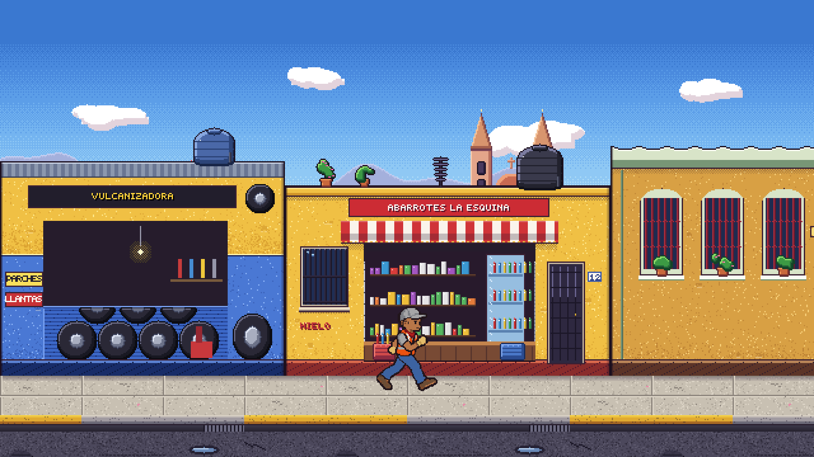
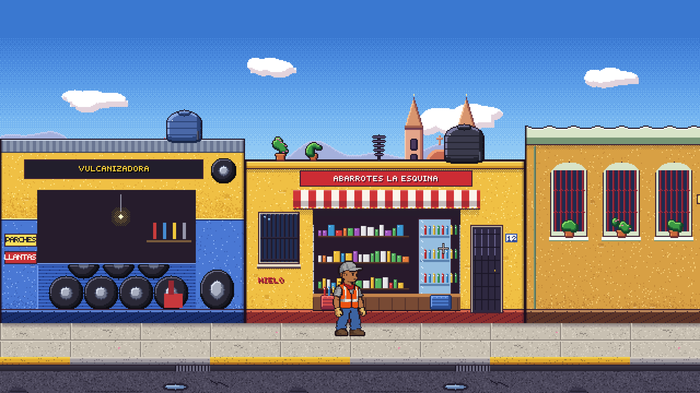

# Videojuego 2D: el recolector

Hiram Agustín Acevedo López · Licenciatura en Desarrollo de Sistemas Web

Proyecto de Unity de la unidad 3 de Optativa Abierta III. Un recolector de basura recorre la calle detrás del camión; cada entrega de la unidad agrega una parte del juego sobre este mismo proyecto.

## Abrir el proyecto

1. Clona el repositorio.
2. En Unity Hub, entra a Projects > Add > Add project from disk y elige la carpeta clonada (la que contiene `Assets`, `Packages` y `ProjectSettings`).
3. Ábrelo con Unity 6000.5.9f1. Usa la plantilla Universal 2D (URP) y el Input System. La primera importación genera `Library` y tarda unos minutos.
4. Abre `Assets/Scenes/Calle.unity`, la escena principal y la primera de Build Settings, y presiona Play.

## Teclas

| Tecla | Qué hace |
|---|---|
| Flecha derecha o D | Correr, mirando a la derecha |
| Flecha izquierda o A | Correr, mirando a la izquierda |
| Ninguna, o las dos direcciones a la vez | Reposo, mirando hacia la última dirección |
| K (sostenida) | Apunta: la mira oscila delante del recolector |
| K (al soltar) | Lanza la bolsa hacia la mira (una por lanzamiento) |
| Barra espaciadora | Lanza la botella, recta hacia donde mira (una por pulsación) |

## La escena y el personaje (entrega 3.1)

- `Main Camera`: cámara ortográfica con Pixel Perfect Camera (URP 2D), 96 píxeles por unidad y resolución de referencia 1920x1080 (desde la entrega 3.2; antes 32 y 640x360). La vista mide 20 por 11.25 unidades: el escenario, a 32 píxeles por unidad, se dibuja a 3 píxeles de pantalla por píxel y el recolector y los proyectiles, a 48, a 2, los dos enteros. Encuadra las fachadas, la banqueta y un poco de asfalto.
- `Grid > Suelo`: Tilemap de la banqueta y el asfalto, con la paleta `Assets/Arte/Paleta/Calle.prefab` (Window > 2D > Tile Palette).
- `Calle`: el script `CalleModular` encadena las fachadas de `Assets/Arte/Escenario/Modulos/` en orden aleatorio con semilla fija, pinta el suelo y repite el cielo hasta cubrir lo que ve la cámara más un margen; lo que queda atrás se recicla. Como la cámara todavía no se mueve, en esta entrega sólo llena la vista.
- `Recolector`: SpriteRenderer, Animator y `RecolectorControl`, de pie sobre la banqueta.

Los sprites del recolector salen de tiras de cuadros del mismo tamaño (`Assets/Arte/Recolector/`), cortadas en modo Multiple con el pivote en los pies y filtro Point. El controlador `Assets/Animaciones/Recolector.controller` tiene dos estados: Reposo (por defecto) y Correr, con transiciones en ambos sentidos sin Has Exit Time y el parámetro bool `corriendo`.

`Assets/Scripts/RecolectorControl.cs` lee el teclado con el Input System (`Keyboard.current`), pone `corriendo` en verdadero mientras hay una dirección pulsada y voltea al personaje con la escala en x.

Por ahora el personaje no se desplaza: cambia de animación y de orientación según la tecla, y lanza la bolsa y la botella (entrega 3.2). La física, el salto, la cámara que lo sigue y el movimiento por la calle llegan en las entregas siguientes.

## Los prefabs (entrega 3.2)

Las balas de este juego son dos prefabs que salen de la misma base, el script `Proyectil`: la bolsa de basura, que se lanza apuntando, y la botella, el proyectil rápido. Los dos nacen en la mano del recolector, no en el centro del personaje, y salen hacia donde está mirando.

- `Assets/Scripts/Proyectil.cs`: la base común. Cada prefab trae su configuración (rapidez, escala de gravedad, vida, giro y cuántos contactos aguanta); `Lanzar(direccion, sentido)` fija la velocidad inicial y la velocidad angular del Rigidbody2D, y la física 2D hace el resto. El proyectil desaparece al salir del encuadre de la cámara o al cumplir su vida. Otro objeto que vuele es un prefab nuevo con otros números.
- `Assets/Prefabs/Bolsa.prefab`: sprite `bolsa.png` (24x24), Rigidbody2D con gravedad, CircleCollider2D (radio 0.19) con el material `Assets/Fisica/Bolsa.physicsMaterial2D` (restitución 0.5, fricción 0.4) y `Proyectil` a 7 unidades por segundo con giro de 200 grados por segundo. Se lanza como en Yoshi's Island: al sostener K aparece la mira (`Mira.cs`, hija del recolector), que oscila sola entre -10 y 70 grados delante de él, a 2.5 unidades de la mano, en ciclos de 1.2 segundos; al soltar K la bolsa sale hacia la mira y la gravedad la curva. Con la mira alta sube por encima de la cabeza y cae unas cuatro unidades adelante; con la mira baja es un tiro corto y tendido. En esta entrega el suelo no tiene collider, así que la bolsa atraviesa la banqueta, sigue cayendo y desaparece al salir de la vista. Conserva su collider, su material y dos rebotes configurados para la 3.3: el rebote llega con la colisión del suelo.
- `Assets/Prefabs/Botella.prefab`: sprite `botella.png` (12x24), Rigidbody2D sin gravedad (escala 0), CapsuleCollider2D y `Proyectil` a 14 unidades por segundo girando a 540 grados por segundo. Sale con la barra espaciadora, recta y horizontal hacia donde mira el recolector, y desaparece al salir de la vista o a los 3 segundos. Es la plantilla de cualquier otro proyectil rápido.
- `PuntoDisparo`: un objeto vacío, hijo del `Recolector`, a la altura de la mano (0.75 unidades por delante del centro y 0.9 sobre los pies); los dos proyectiles nacen ahí. Como es hijo, cuando el personaje se voltea con la escala en x el punto y la mira pasan al otro lado.
- `RecolectorControl.cs`: lee las dos teclas con el Input System (`wasPressedThisFrame` y `wasReleasedThisFrame`: un proyectil por pulsación), instancia el prefab en `PuntoDisparo` y le pasa la dirección: la de la mira para la bolsa, la horizontal hacia donde mira para la botella. Los proyectiles no chocan con el recolector ni entre sí (`Physics2D.IgnoreCollision`).

La cadencia del lanzamiento y los efectos del proyectil llegan en la 3.7, la animación de lanzar en la 3.6, y el collider del suelo con la física del recolector (gravedad, salto, colisiones) en la 3.3.

## Arte

Todo el arte es original y está hecho para este proyecto. El recolector es pixel art de 128x128 por cuadro, editado en Aseprite: 8 cuadros de reposo y 12 de carrera, con los pies en la misma línea en todos los cuadros; se importa a 48 píxeles por unidad para quedar en proporción con las fachadas. La bolsa (24x24), la botella (12x24) y la mira (15x15) son sprites hechos pixel por pixel con colores de la paleta del recolector. Las fachadas, el suelo, el cielo, el camión, el perro y la moneda de peso son pixel art hecho con código, sin recursos descargados.

## Qué se versiona

`Assets`, `Packages` y `ProjectSettings`, con sus archivos `.meta`. `Library`, `Temp`, `Logs`, `UserSettings` y las compilaciones quedan fuera por el `.gitignore`.
